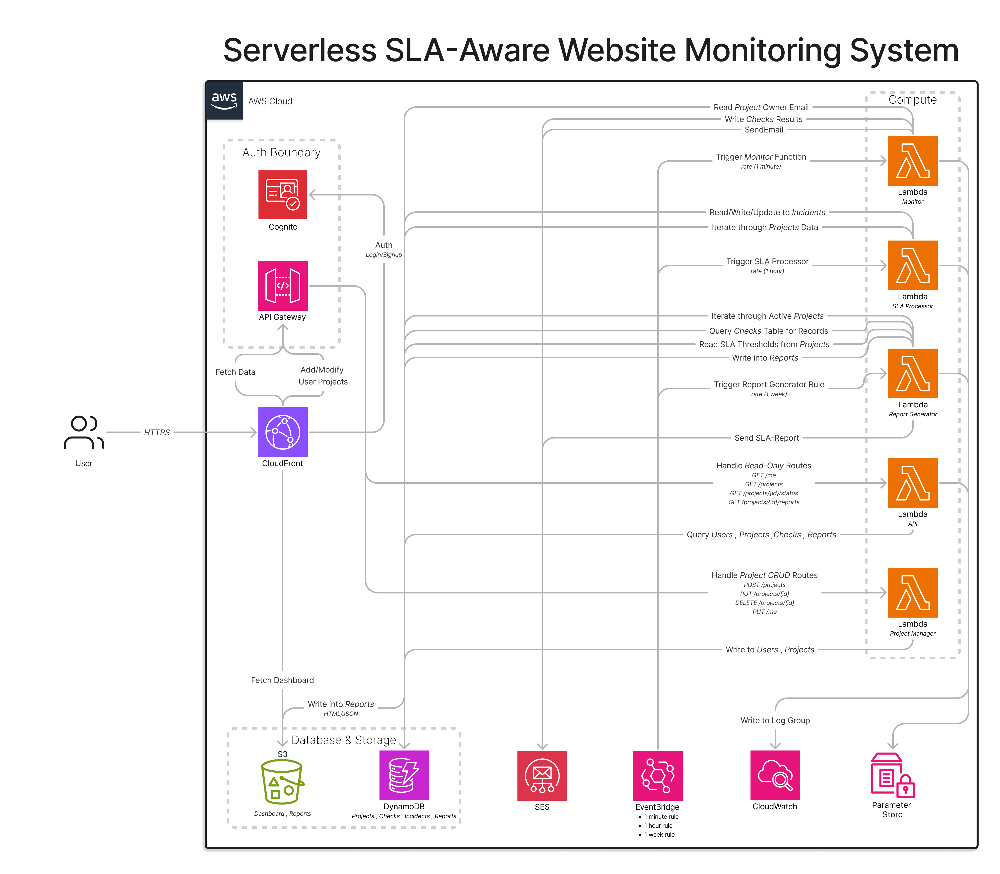
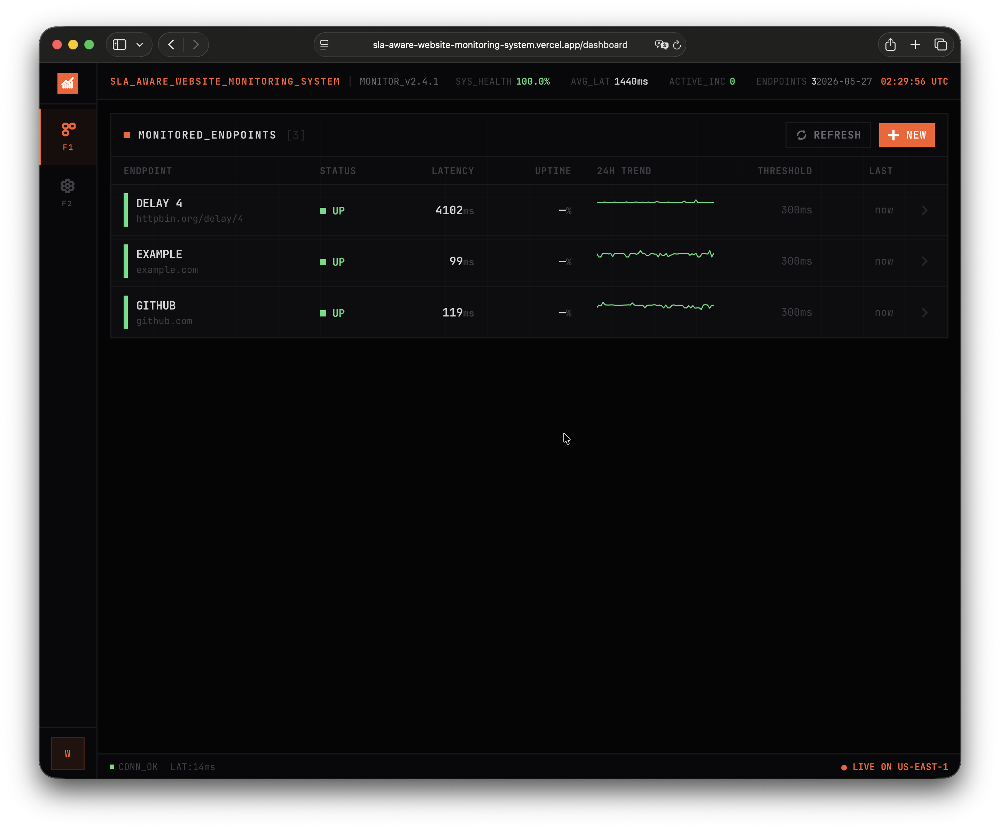
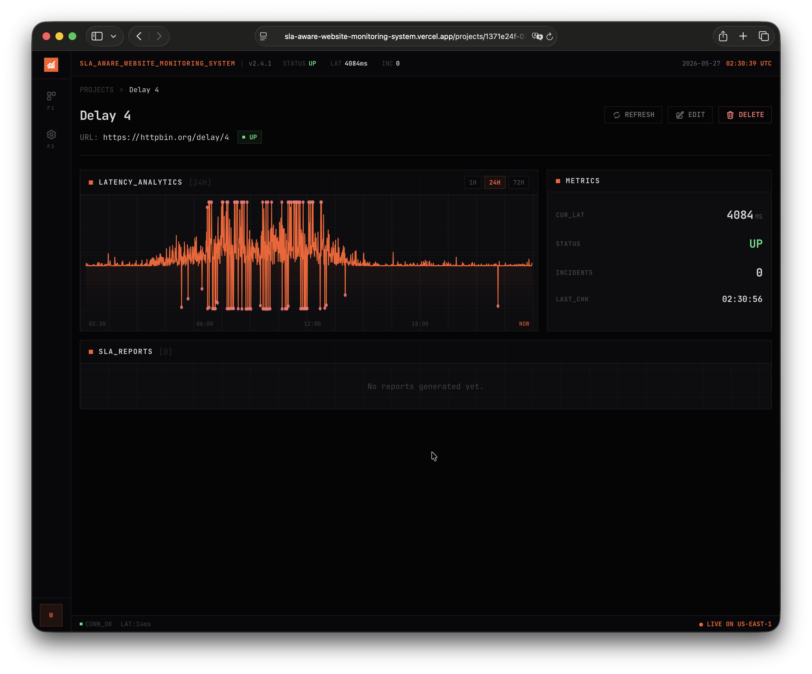
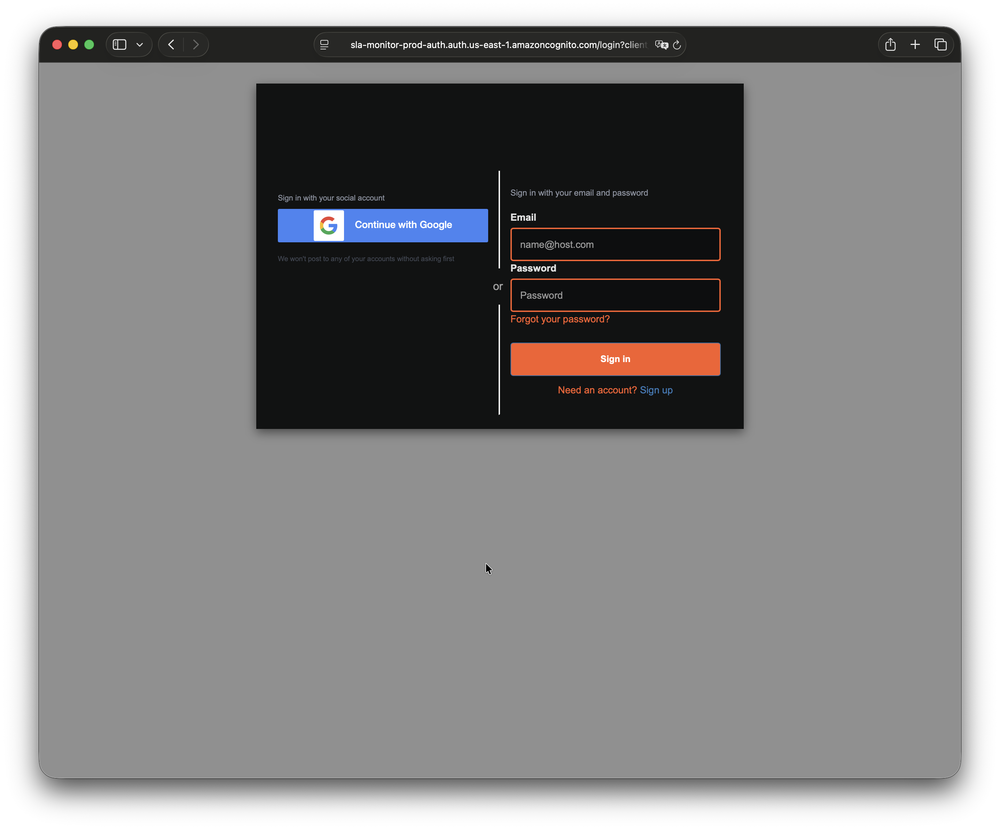

# SLA-Aware Website Monitoring System

A serverless AWS platform that monitors HTTP endpoints, detects incidents from consecutive failures, computes SLA metrics (uptime, latency percentiles, MTTR, MTBF), and generates weekly reports. Infrastructure is fully managed via Terraform with remote state in Terraform Cloud.

---

## AWS Architecture

The system is event-driven and serverless. No persistent compute runs outside of Lambda invocations.

### Workflow

- **Monitoring** : EventBridge triggers the [Monitor Lambda](sla-monitor-terraform/lambda_src/monitor/handler.py) every minute. It scans the projects table for active targets, sends HTTP requests, and writes results (status, latency, HTTP code) to the checks table. On status change (UP→DOWN or DOWN→UP), it sends an alert via SES.

- **Incident Detection** : EventBridge triggers the [SLA Processor Lambda](sla-monitor-terraform/lambda_src/sla_processor/handler.py) every hour. It reads recent checks and counts consecutive failures per project. When the count hits the project's configured threshold, it creates an incident record. On recovery, it closes the incident and records the duration.

- **Report Generation** : EventBridge triggers the [Report Generator Lambda](sla-monitor-terraform/lambda_src/report_generator/handler.py) every Monday at 08:00 UTC. It aggregates checks and incidents from the past week, computes the full SLA metric suite (uptime %, avg/p50/p95/p99 latency, error rate, incident count, total downtime, longest incident, MTTR, MTBF), evaluates against per-project thresholds, assigns severity, stores the report in DynamoDB, uploads JSON and HTML to S3, and emails the result via SES.

- **API & Dashboard** : API Gateway (HTTP API v2) fronts two Lambda functions. The [API Lambda](sla-monitor-terraform/lambda_src/api/handler.py) handles all read-only routes. The [Project Manager Lambda](sla-monitor-terraform/lambda_src/project_manager/handler.py) handles writes (users, projects). The frontend React SPA calls both through the same gateway.

- **Authentication** : Cognito User Pool with native email/password and Google OAuth 2.0. API Gateway validates JWTs via its built-in authorizer before forwarding requests to either Lambda.

---

## Design Decisions

### Serverless

Since the workload is time-based and bursty :
  - **Once a minute** : is a burst of HTTP requests, and nothing else in between *(for the most part, most of the time)*.
  - **Once an hour** :  data scan.
  - **Once a week** :  heavier aggregation, but Lambda still makes more sense.

>Lambda is the best fit for this kind of workload, no idle cost. *and EventBridge handles scheduling at no additional charge*.

### DynamoDB

The access patterns are well-defined and do not require complex joins. The checks table writes at high frequency (one record per project per minute), so on-demand billing avoids provisioned capacity waste. TTL is set to 90 days on checks. Point-in-time recovery is enabled on configuration and report tables where data loss would be problematic.

The checks table uses a composite key (project ID partition, timestamp sort) for efficient time-range queries. The projects table has a GSI on user ID so the dashboard can list a user's projects without scanning the full table.

### Why split the API across two Lambdas ?

The API Lambda is read-only. It cannot create incidents, delete checks, or send emails. 
The Project Manager Lambda only touches users and projects. 

If the read path is compromised, the blast radius is limited. This separation also makes permissions explicit and auditable.

### Why Terraform Cloud

Remote state with locking and versioning, which eliminates the risk of state file corruption or merge conflicts.

---

## Data Layer : DynamoDB

| Table | Purpose | Key Design |
|-------|---------|------------|
| **users** | Profile data | Simple hash key (`user_id`) |
| **projects** | Monitoring targets (URL, thresholds, alerts) | Hash key (`project_id`) + GSI on `user_id` for user-scoped queries |
| **checks** | Raw HTTP check results | Composite key (`project_id` / `timestamp`) for time-range queries. TTL = 90 days |
| **incidents** | Failure episodes | Composite key (`project_id` / `start_time`) for chronological ordering |
| **reports** | Pre-computed weekly SLA aggregates | Composite key (`project_id` / `report_id`). Dashboard reads these instead of re-aggregating raw checks |

---

## Compute Layer : Lambda 

Each Lambda has a dedicated IAM role scoped to the exact tables and actions it needs. Following the principle of least privilege

| Function | Trigger | Responsibility [see diagram](./assets/AWS_Architecture.png) | IAM Scope |
|----------|---------|----------------|-----------|
| **Monitor** | EventBridge (1 min) | HTTP checks, write checks, alert on status change | Read projects, write checks, send SES, read SSM |
| **SLA Processor** | EventBridge (1 hour) | Detect consecutive failures, create/close incidents | Read projects/checks, manage incidents |
| **Report Generator** | EventBridge (1 week) | Aggregate metrics, evaluate thresholds, generate and email reports | Read projects/checks/incidents, write reports, write S3, send SES, read SSM |
| **API** | API Gateway | Read-only dashboard data | Read all tables (including GSI) |
| **Project Manager** | API Gateway | User and project CRUD | Read/write users and projects only |

---

## Security

- **IAM** : No shared roles. No wildcards on DynamoDB or S3. Each Lambda policy references exact table ARNs and S3 prefixes. The API Lambda has zero write permissions.

- **Authentication** : Cognito handles registration, verification, password policies, and token issuance. Google OAuth is wired in as an IdP.

- **API Gateway** : JWT authorizer validates tokens against Cognito's JWKS before any request reaches a Lambda. The Lambda receives the authenticated user's identity in the request context.

---

## Frontend

React 18 SPA built with Vite and Tailwind CSS. Deployed separately (Vercel).

The app routes through five views:

- **Login** : redirects to Cognito Hosted UI
- **Callback** : exchanges OAuth code for tokens
- **Dashboard** : project card grid with add-project flow
- **Project Detail** : latency charts, incident timeline, report history
- **Settings** : profile editing

The project detail page shows a time-series latency chart (p50/p95/p99), an incident list with durations, and weekly SLA report cards with pass/fail verdicts. All API calls include the Cognito access token in the Authorization header. Token refresh is handled silently; on failure, the user is redirected to login.

---

## Infrastructure as Code

Terraform code is under [`sla-monitor-terraform/`](sla-monitor-terraform/). State is managed in Terraform Cloud.

### Modules

- [`modules/dynamodb/`](sla-monitor-terraform/modules/dynamodb/) : Five tables with per-table TTL, GSI, and PITR configuration.
- [`modules/s3/`](sla-monitor-terraform/modules/s3/) : Reports bucket (lifecycle: Glacier IR after 60 days, version expiry after 90 days) and artifacts bucket (Lambda deployment packages, version expiry after 7 days).
- [`modules/iam/`](sla-monitor-terraform/modules/iam/) : Five roles with custom policy documents scoped to exact resource ARNs.
- [`modules/lambda/`](sla-monitor-terraform/modules/lambda/) : Reusable factory: archive source, upload to S3 keyed by content hash, create function and log group, attach invoke permissions. Immutable deployments — code changes produce new S3 objects and trigger updates.
- [`modules/apigateway/`](sla-monitor-terraform/modules/apigateway/) : HTTP API v2, JWT authorizer, routes, integrations, structured access logs.
- [`modules/cognito/`](sla-monitor-terraform/modules/cognito/) : User pool, Google IdP, app client, hosted UI customization.

The root [`main.tf`](sla-monitor-terraform/main.tf) wires modules together and defines EventBridge rules and cross-module permissions.

---

## Screenshots

#### Dashboard

#### Project Details

#### Cognito HostedUI
Supports normal Email+Password Login and Google OAuth 2.0

---

## License

MIT — see [LICENSE](./LICENSE)
